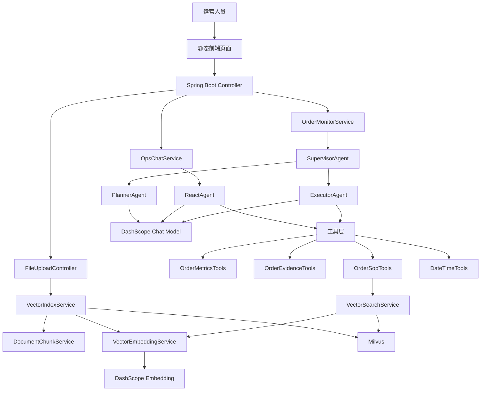

# 电商平台异常订单监控 Agent 产品文档

文档版本：v1.0  
适用项目：基于老师示例项目 `SuperBizAgent` 的简化包装版  
目标读者：初学者、课程答辩者、项目实现者  
项目名称：`OrderWatch Agent：电商异常订单监控助手`

## 1. 文档结论

本项目定位为“电商运营异常订单监控 Agent”，不是完整电商平台，也不是复杂风控系统。

第一版只做三个核心能力：

1. 运营人员可以和 Agent 对话，询问异常订单、处理规则、SOP 和话术。
2. 系统可以一键生成《异常订单监控报告》。
3. 系统支持上传运营规则文档，通过 RAG 检索后辅助回答和报告生成。

本项目本质上是老师示例项目的业务语义替换：

| 老师示例项目 | 本项目包装后 |
|---|---|
| 智能 OnCall / AI Ops | 电商异常订单监控 |
| Prometheus 告警 | 异常订单指标 |
| 系统日志 / 应用日志 | 订单记录 / 支付记录 / 客服工单 |
| 运维处理文档 | 运营 SOP / 异常订单处理规则 |
| `/api/chat` | `/api/ops_chat` |
| `/api/chat_stream` | `/api/ops_chat_stream` |
| `/api/ai_ops` | `/api/order_anomaly_monitor` |
| `QueryMetricsTools` | `OrderMetricsTools` |
| `QueryLogsTools` | `OrderEvidenceTools` |
| `InternalDocsTools` | `OrderSopTools` |

第一版不做订单增删改查、不做真实支付风控、不做完整 BI 看板、不做自动退款或自动封单。系统只负责“查询证据、检索规则、生成建议”，最终处理动作仍由运营人员确认。

## 2. 产品定位

### 2.1 一句话定位

`OrderWatch Agent` 是一个面向电商运营人员的 AI 助手，用于监控异常订单、检索运营规则，并生成可解释的异常订单分析报告。

### 2.2 目标用户

| 用户 | 关注点 |
|---|---|
| 电商运营 | 异常订单数量、异常类型、受影响商品、处理建议 |
| 客服 / 售后 | 用户投诉、退款申请、订单问题处理话术 |
| 店铺负责人 | 风险等级、影响范围、是否需要人工介入 |

### 2.3 产品边界

本项目要做：

- 运营问答：运营人员输入问题，Agent 结合工具和 RAG 回答。
- 异常订单监控报告：点击按钮后自动查询异常订单指标、订单证据和 SOP，输出 Markdown 报告。
- 知识库上传：上传 `.md` 或 `.txt` 文件，写入 Milvus 向量库。
- Mock 数据演示：用模拟数据跑通完整流程，降低实现难度。

本项目不做：

- 不做完整订单后台。
- 不做真实支付、退款、库存、物流系统对接。
- 不做用户画像、黑产识别、复杂风控模型。
- 不做自动处罚、自动退款、自动拦截订单。
- 不做复杂权限系统。

## 3. 需求范围

### 3.1 核心场景一：运营日常沟通

运营人员可以输入自然语言问题，例如：

- 最近 24 小时有哪些异常订单？
- 大额订单异常应该怎么处理？
- 同一用户短时间内多次下单是否需要人工审核？
- 订单取消率突然升高，运营应该先看什么？
- 客服遇到疑似刷单用户应该怎么回复？

系统处理链路：

```text
运营提问
-> /api/ops_chat 或 /api/ops_chat_stream
-> ReactAgent
-> 判断是否需要调用工具
-> 查询异常指标 / 查询订单证据 / 检索 SOP
-> 返回答案
```

### 3.2 核心场景二：生成异常订单监控报告

运营人员点击“异常订单监控”按钮，系统自动生成报告。

系统处理链路：

```text
点击异常订单监控
-> /api/order_anomaly_monitor
-> SupervisorAgent
-> PlannerAgent 制定排查计划
-> ExecutorAgent 调用工具查询数据
-> PlannerAgent 汇总最终报告
-> SSE 流式返回 Markdown 报告
```

报告必须包含：

- 异常概览
- 异常订单清单
- 证据摘要
- 命中的运营 SOP
- 可能原因
- 处理建议
- 需要人工确认的事项

### 3.3 核心场景三：上传运营知识文档

运营人员上传 SOP 文档，例如：

- `大额订单人工审核规则.md`
- `频繁取消订单处理规则.md`
- `疑似刷单订单排查 SOP.md`
- `客服异常订单沟通话术.md`
- `退款异常处理流程.md`

系统处理链路：

```text
上传 Markdown 文档
-> FileUploadController
-> 保存到 uploads 目录
-> DocumentChunkService 分片
-> VectorEmbeddingService 生成向量
-> VectorIndexService 写入 Milvus
-> OrderSopTools 检索 SOP
```

## 4. 总体架构

### 4.1 架构原则

本项目严格沿用老师示例项目的技术复杂度，只做业务替换和少量重命名：

- 后端仍然使用 Spring Boot。
- 前端仍然使用静态 HTML / CSS / JavaScript。
- 大模型仍然使用 DashScope。
- 向量数据库仍然使用 Milvus。
- RAG 仍然使用“文档上传 -> 分片 -> Embedding -> 向量检索”的链路。
- Agent 仍然使用 ReactAgent 和 SupervisorAgent。
- 工具仍然使用 Spring AI `@Tool` 注解暴露。

### 4.2 架构图



### 4.3 目标目录结构

```text
src/main/java/org/example/
  Main.java
  controller/
    OpsChatController.java              # 运营对话、监控报告接口
    FileUploadController.java           # 文件上传接口，沿用示例逻辑
    MilvusCheckController.java          # Milvus 健康检查，沿用示例逻辑
  service/
    OpsChatService.java                 # 运营对话服务，来源于 ChatService
    OrderMonitorService.java            # 异常订单监控服务，来源于 AiOpsService
    RagService.java                     # RAG 预留服务，可沿用
    DocumentChunkService.java           # 文档分片，沿用
    VectorEmbeddingService.java         # 向量生成，沿用
    VectorIndexService.java             # 文档入库，沿用
    VectorSearchService.java            # 向量检索，沿用
  agent/tool/
    OrderMetricsTools.java              # 查询异常订单指标
    OrderEvidenceTools.java             # 查询订单证据
    OrderSopTools.java                  # 检索运营 SOP
    DateTimeTools.java                  # 获取当前时间，沿用
  dto/
    OpsChatRequest.java
    OpsChatResponse.java
    OrderAnomaly.java
    OrderEvidenceRecord.java
    OrderMonitorReport.java
    FileUploadRes.java
    DocumentChunk.java
  config/
    DashScopeConfig.java
    MilvusConfig.java
    MilvusProperties.java
    FileUploadConfig.java
    DocumentChunkConfig.java

src/main/resources/
  application.yml
  static/
    index.html
    app.js
    styles.css

order-docs/
  大额订单人工审核规则.md
  频繁取消订单处理规则.md
  疑似刷单订单排查SOP.md
  客服异常订单沟通话术.md
```

说明：从 0 实现时使用上面的业务命名。若是在老师示例代码上改造，允许先保留旧类名，但对外接口路径、Prompt、Mock 数据和前端文案必须以本文档为准。

## 5. 技术选型

| 类型 | 选型 | 说明 |
|---|---|---|
| 开发语言 | Java 17 | 与老师示例项目一致 |
| Web 框架 | Spring Boot 3.2.0 | 提供 REST API 和静态资源服务 |
| Agent 框架 | Spring AI Alibaba Agent Framework | 沿用 ReactAgent、SupervisorAgent |
| 大模型服务 | DashScope | 沿用老师示例项目，不新增模型供应商 |
| 对话模型 | `DashScopeChatModel.DEFAULT_MODEL_NAME` | 日常运营问答使用默认对话模型 |
| 报告模型参数 | temperature = 0.3, maxToken = 8000 | 报告生成需要更稳定、更长输出 |
| RAG 生成模型 | `rag.model` 配置项，默认按 `application.yml` | 示例项目配置为 `qwen3-max` |
| Embedding 模型 | `text-embedding-v4` | 生成 1024 维向量 |
| 向量数据库 | Milvus | 存储 SOP 文档向量 |
| 文档格式 | Markdown / TXT | 与示例项目上传限制一致 |
| 前端 | 原生 HTML / CSS / JavaScript | 避免引入 Vue / React，降低难度 |
| 流式输出 | SSE | 沿用示例项目 `SseEmitter` |
| 数据源 | Mock 数据 | 第一版不对接真实订单库 |

模型选择原则：

- 不做“多模型路由”，避免超过示例难度。
- 不引入本地模型部署，避免环境复杂。
- 对话和报告都使用 DashScope，Embedding 也使用 DashScope。
- 所有模型名放在 `application.yml`，不要写死在业务代码里。

## 6. 接口设计

### 6.1 统一响应结构

所有普通 JSON 接口统一返回：

```json
{
  "code": 200,
  "message": "success",
  "data": {}
}
```

字段说明：

| 字段 | 类型 | 说明 |
|---|---|---|
| `code` | number | 200 表示成功，500 表示失败 |
| `message` | string | 成功或错误说明 |
| `data` | object | 业务数据 |

### 6.2 运营普通对话

接口：

```text
POST /api/ops_chat
Content-Type: application/json
```

请求体：

```json
{
  "Id": "session-001",
  "Question": "最近 24 小时有哪些异常订单？"
}
```

响应体：

```json
{
  "code": 200,
  "message": "success",
  "data": {
    "success": true,
    "answer": "根据当前异常订单指标，近 24 小时主要异常集中在大额订单和频繁取消订单...",
    "errorMessage": null
  }
}
```

实现来源：等价于老师示例项目的 `POST /api/chat`。

### 6.3 运营流式对话

接口：

```text
POST /api/ops_chat_stream
Content-Type: application/json
Accept: text/event-stream
```

请求体：

```json
{
  "Id": "session-001",
  "Question": "大额订单异常应该怎么排查？"
}
```

SSE 消息格式：

```json
{
  "type": "content",
  "data": "大额订单异常建议先核对支付状态、收货地址和历史下单行为..."
}
```

结束消息：

```json
{
  "type": "done",
  "data": null
}
```

错误消息：

```json
{
  "type": "error",
  "data": "问题内容不能为空"
}
```

实现来源：等价于老师示例项目的 `POST /api/chat_stream`。

### 6.4 一键异常订单监控报告

接口：

```text
POST /api/order_anomaly_monitor
Accept: text/event-stream
```

第一版不要求请求体，点击按钮即可触发。时间范围默认由工具返回的 Mock 数据决定，通常表达为“最近 24 小时”。

SSE 返回：

```json
{
  "type": "content",
  "data": "# 异常订单监控报告\n\n## 1. 异常概览..."
}
```

实现来源：等价于老师示例项目的 `POST /api/ai_ops`。

报告模板：

```text
# 异常订单监控报告

## 1. 异常概览
说明异常时间窗口、异常类型、影响订单数、风险等级。

## 2. 异常订单清单
列出异常 ID、异常类型、商品 / 用户 / 订单信息、当前状态。

## 3. 证据摘要
引用订单记录、支付记录、客服工单或用户行为记录。

## 4. SOP 命中
说明命中了哪些运营规则或处理流程。

## 5. 可能原因
基于证据给出可能原因，不写绝对结论。

## 6. 处理建议
给运营、客服、店铺负责人分别提供可执行建议。

## 7. 需要人工确认
列出必须由人工复核的订单或规则。
```

### 6.5 清空会话历史

接口：

```text
POST /api/ops_chat/clear
Content-Type: application/json
```

请求体：

```json
{
  "Id": "session-001"
}
```

响应体：

```json
{
  "code": 200,
  "message": "success",
  "data": "会话历史已清空"
}
```

实现来源：等价于老师示例项目的 `POST /api/chat/clear`。

### 6.6 查询会话信息

接口：

```text
GET /api/ops_chat/session/{sessionId}
```

响应体：

```json
{
  "code": 200,
  "message": "success",
  "data": {
    "sessionId": "session-001",
    "messagePairCount": 2,
    "createTime": 1777255200000
  }
}
```

实现来源：等价于老师示例项目的 `GET /api/chat/session/{sessionId}`。

### 6.7 上传运营文档

接口：

```text
POST /api/upload
Content-Type: multipart/form-data
```

请求参数：

| 参数 | 类型 | 必填 | 说明 |
|---|---|---|---|
| `file` | file | 是 | 仅支持 `.md`、`.txt` |

响应体：

```json
{
  "code": 200,
  "message": "success",
  "data": {
    "fileName": "大额订单人工审核规则.md",
    "filePath": "./uploads/大额订单人工审核规则.md",
    "fileSize": 2048
  }
}
```

实现来源：直接沿用老师示例项目的 `POST /api/upload`。

### 6.8 Milvus 健康检查

接口：

```text
GET /milvus/health
```

响应体：

```json
{
  "message": "ok",
  "collections": ["biz"]
}
```

实现来源：直接沿用老师示例项目的 `GET /milvus/health`。

## 7. 数据封装设计

### 7.1 OpsChatRequest

```java
public class OpsChatRequest {
    private String Id;
    private String Question;
}
```

说明：保持与老师示例项目 `ChatRequest` 一致，降低前后端改造成本。

### 7.2 OpsChatResponse

```java
public class OpsChatResponse {
    private boolean success;
    private String answer;
    private String errorMessage;
}
```

### 7.3 SseMessage

```java
public class SseMessage {
    private String type; // content, error, done
    private String data;
}
```

### 7.4 OrderAnomaly

用于封装异常订单指标工具返回的数据。

```java
public class OrderAnomaly {
    private String anomalyId;
    private String orderId;
    private String userId;
    private String productId;
    private String skuId;
    private String anomalyType;
    private String metric;
    private String currentValue;
    private String baselineValue;
    private String timeWindow;
    private String severity;
    private String summary;
}
```

字段说明：

| 字段 | 说明 |
|---|---|
| `anomalyId` | 异常 ID，例如 `ANOM-001` |
| `orderId` | 订单 ID，可使用脱敏或 Mock 值 |
| `userId` | 用户 ID，可使用脱敏或 Mock 值 |
| `productId` | 商品 ID |
| `skuId` | SKU ID |
| `anomalyType` | 异常类型，例如大额订单、频繁取消、重复下单 |
| `metric` | 异常指标名称 |
| `currentValue` | 当前值 |
| `baselineValue` | 基线值 |
| `timeWindow` | 时间窗口 |
| `severity` | 风险等级：low、medium、high |
| `summary` | 简短摘要 |

### 7.5 OrderEvidenceRecord

用于封装订单证据工具返回的数据。

```java
public class OrderEvidenceRecord {
    private String topic;
    private String recordId;
    private String orderId;
    private String userId;
    private String timestamp;
    private String evidenceType;
    private String content;
    private Map<String, String> tags;
}
```

第一版只保留三个证据主题：

| topic | 说明 | 对应老师示例 |
|---|---|---|
| `order-records` | 订单记录 | 日志主题 |
| `payment-records` | 支付记录 | 日志主题 |
| `customer-tickets` | 客服工单 | 日志主题 |

### 7.6 DocumentChunk

直接沿用老师示例项目：

```java
public class DocumentChunk {
    private String content;
    private int startIndex;
    private int endIndex;
    private int chunkIndex;
    private String title;
}
```

### 7.7 Milvus 向量记录

Milvus collection 继续使用老师示例项目中的 `biz`。

| 字段 | 类型 | 说明 |
|---|---|---|
| `id` | VarChar | 主键，使用文件路径 + 分片序号生成 |
| `content` | VarChar | 文档分片内容 |
| `vector` | FloatVector | 1024 维向量 |
| `metadata` | JSON | 文件名、来源、分片序号、标题等 |

metadata 建议结构：

```json
{
  "_source": "./uploads/大额订单人工审核规则.md",
  "_file_name": "大额订单人工审核规则.md",
  "_extension": ".md",
  "chunkIndex": 0,
  "totalChunks": 3,
  "title": "人工审核条件",
  "bizType": "order_sop"
}
```

## 8. 工具调用设计

第一版只设计 5 个工具，数量与老师示例项目保持一致，不增加难度。

### 8.1 getCurrentDateTime

来源：直接沿用 `DateTimeTools`。

作用：获取当前时间，用于报告中的时间窗口说明。

工具返回示例：

```text
2026-04-27T10:30:00+08:00[Asia/Shanghai]
```

### 8.2 queryOrderAnomalies

来源：由 `QueryMetricsTools.queryPrometheusAlerts()` 改造。

作用：查询当前异常订单指标。第一版使用 Mock 数据。

工具返回示例：

```json
{
  "success": true,
  "message": "成功检索到 3 个异常订单信号",
  "anomalies": [
    {
      "anomalyId": "ANOM-001",
      "orderId": "ORDER-20260427-001",
      "userId": "USER-10086",
      "productId": "SKU-PHONE-256",
      "skuId": "SKU-PHONE-256-BLACK",
      "anomalyType": "large_amount_order",
      "metric": "order_amount",
      "currentValue": "12999",
      "baselineValue": "店铺客单价 389",
      "timeWindow": "最近 24 小时",
      "severity": "high",
      "summary": "单笔订单金额显著高于店铺日常客单价，建议人工复核"
    }
  ]
}
```

### 8.3 getAvailableEvidenceTopics

来源：由 `QueryLogsTools.getAvailableLogTopics()` 改造。

作用：让 Agent 先知道有哪些证据源，避免乱查。

工具返回示例：

```json
{
  "success": true,
  "topics": [
    {
      "topicName": "order-records",
      "description": "订单记录，包含订单金额、商品、下单时间、取消状态",
      "exampleQueries": ["order_amount:>5000", "cancel_count:>3"]
    },
    {
      "topicName": "payment-records",
      "description": "支付记录，包含支付状态、支付时间、支付渠道",
      "exampleQueries": ["payment_status:FAILED", "amount:>5000"]
    },
    {
      "topicName": "customer-tickets",
      "description": "客服工单，包含用户咨询、投诉、退款说明",
      "exampleQueries": ["refund OR complaint", "疑似刷单"]
    }
  ]
}
```

### 8.4 queryOrderEvidence

来源：由 `QueryLogsTools.queryLogs()` 改造。

作用：查询订单证据。第一版只查 Mock 数据，不对接真实数据库。

入参：

| 参数 | 类型 | 必填 | 说明 |
|---|---|---|---|
| `topic` | string | 是 | `order-records`、`payment-records`、`customer-tickets` |
| `query` | string | 否 | 查询条件 |
| `limit` | integer | 否 | 返回条数，默认 20 |

工具返回示例：

```json
{
  "success": true,
  "topic": "order-records",
  "query": "order_amount:>5000",
  "total": 2,
  "records": [
    {
      "topic": "order-records",
      "recordId": "REC-001",
      "orderId": "ORDER-20260427-001",
      "userId": "USER-10086",
      "timestamp": "2026-04-27 10:12:30",
      "evidenceType": "order",
      "content": "订单金额 12999 元，收货地址为首次使用地址，用户历史客单价低于 400 元",
      "tags": {
        "amount": "12999",
        "risk": "large_amount"
      }
    }
  ]
}
```

### 8.5 queryOrderSop

来源：由 `InternalDocsTools.queryInternalDocs()` 改造。

作用：从 Milvus 中检索运营 SOP。

入参：

| 参数 | 类型 | 必填 | 说明 |
|---|---|---|---|
| `query` | string | 是 | 搜索问题，例如“大额订单人工审核规则” |

返回：JSON 格式的相似文档片段。

说明：RAG 只负责查规则，不负责直接判断订单一定异常。最终结论必须结合异常指标和证据。

## 9. RAG 设计

### 9.1 RAG 的职责

RAG 只解决“规则从哪里来”的问题：

- 查询异常订单处理 SOP。
- 查询客服沟通话术。
- 查询人工审核规则。
- 查询退款、取消、重复下单等处理流程。

RAG 不负责：

- 不直接生成订单数据。
- 不凭空判断用户是否违规。
- 不代替工具查询异常指标。

### 9.2 文档入库流程

```text
上传文件
-> 校验文件格式
-> 保存到 uploads
-> 按 Markdown 标题和段落分片
-> 每个分片生成 Embedding
-> 写入 Milvus biz collection
-> 对话或报告中通过 queryOrderSop 检索
```

### 9.3 分片策略

沿用老师示例项目配置：

```yaml
document:
  chunk:
    max-size: 800
    overlap: 100
```

说明：

- 每个分片最大 800 字符。
- 相邻分片重叠 100 字符。
- 优先按 Markdown 标题和段落切分。

### 9.4 检索策略

沿用老师示例项目配置：

```yaml
rag:
  top-k: 3
```

说明：

- 每次最多返回 3 个最相关片段。
- 报告中只能引用命中的 SOP 内容。
- 如果没有命中文档，需要明确说明“知识库未检索到相关 SOP”。

## 10. Agent 设计

### 10.1 运营问答 Agent

使用 `ReactAgent`。

职责：

- 理解运营问题。
- 判断是否需要工具调用。
- 调用异常指标、订单证据、SOP、时间工具。
- 结合工具结果回答。
- 维护最多 6 轮消息历史。

系统提示词要点：

```text
你是电商平台异常订单监控助手，服务对象是运营人员。
当用户询问当前异常订单、风险指标、订单状态时，调用 queryOrderAnomalies。
当用户需要证据时，先调用 getAvailableEvidenceTopics，再调用 queryOrderEvidence。
当用户询问处理规则、SOP、客服话术时，调用 queryOrderSop。
当用户询问当前时间或时间窗口时，调用 getCurrentDateTime。
不得编造订单、金额、用户信息；没有工具结果时必须说明无法确认。
```

### 10.2 异常订单监控 Agent

使用老师示例项目已有的 `SupervisorAgent + PlannerAgent + ExecutorAgent`。

| Agent | 职责 |
|---|---|
| `SupervisorAgent` | 调度 Planner 和 Executor |
| `PlannerAgent` | 制定排查计划，并在结束时生成 Markdown 报告 |
| `ExecutorAgent` | 根据 Planner 的第一步调用工具并整理证据 |

第一版不新增更多 Agent。

Planner 输出要求：

- 中间步骤可以输出 JSON。
- 最终 `FINISH` 必须直接输出 Markdown 报告。
- 报告不能编造工具没有返回的数据。
- 对不确定结论要写“可能原因”，不能写成绝对因果。

Executor 输出要求：

- 每次只执行 Planner 指定的第一步。
- 工具失败或无结果时要如实反馈。
- 返回结构化证据，方便 Planner 汇总。

## 11. Mock 数据设计

第一版推荐固定 3 类异常，覆盖演示需要即可。

### 11.1 大额订单异常

```text
异常 ID：ANOM-001
订单：ORDER-20260427-001
类型：large_amount_order
表现：订单金额 12999 元，显著高于店铺客单价 389 元
证据：新地址、首次购买高价商品、支付成功但客服备注要求尽快发货
建议：进入人工审核，不立即发货
```

### 11.2 频繁取消订单异常

```text
异常 ID：ANOM-002
用户：USER-20488
类型：frequent_cancellation
表现：同一用户 24 小时内下单 8 次，取消 6 次
证据：订单记录显示多个 SKU 被反复下单取消
建议：客服确认真实购买意图，必要时限制优惠券使用
```

### 11.3 同地址多账号下单异常

```text
异常 ID：ANOM-003
地址：ADDR-MOCK-009
类型：same_address_multi_account
表现：同一收货地址关联 5 个新用户账号
证据：支付渠道相近、收货电话相似、购买同一活动商品
建议：人工审核活动资格，避免误伤真实用户
```

## 12. 前端设计

沿用老师示例项目静态前端，只改文案和按钮。

| 原前端元素 | 新前端元素 |
|---|---|
| 智能 OnCall 助手 | 异常订单监控助手 |
| AI Ops 按钮 | 异常订单监控 |
| 问问智能 OnCall 助手 | 问问异常订单监控助手 |
| 上传文件 | 上传运营 SOP |
| 快速 / 流式 | 保留 |
| 近期对话 | 保留 |

第一版页面只需要：

- 左侧历史对话。
- 中间聊天区。
- 底部输入框。
- 上传 SOP 入口。
- 快速 / 流式模式切换。
- 异常订单监控按钮。

不需要新增图表、表格大屏、复杂筛选器。

## 13. 配置设计

`application.yml` 建议保持与老师示例项目一致，只调整业务注释：

```yaml
server:
  port: 9900

file:
  upload:
    path: ./uploads
    allowed-extensions: txt,md

milvus:
  host: localhost
  port: 19530
  database: default
  timeout: 10000

spring:
  ai:
    dashscope:
      api-key: ${DASHSCOPE_API_KEY:your-api-key-here}

dashscope:
  api:
    key: ${DASHSCOPE_API_KEY:your-api-key-here}
  embedding:
    model: text-embedding-v4

document:
  chunk:
    max-size: 800
    overlap: 100

rag:
  top-k: 3
  model: qwen3-max

order:
  mock-enabled: true
```

说明：

- `order.mock-enabled=true` 表示使用 Mock 异常订单数据。
- 第一版不需要配置真实订单数据库连接。
- `DASHSCOPE_API_KEY` 必须通过环境变量配置。

## 14. 从 0 实现步骤

### 阶段一：搭建与示例一致的项目骨架

目标：先搭建一个与老师示例项目复杂度一致、可以正常启动的基础工程。

任务：

- 保留 Maven、Spring Boot、DashScope、Milvus 配置。
- 保留 `vector-database.yml`。
- 保留文件上传、向量化、Milvus 健康检查能力。
- 确认 `/milvus/health` 可用。

### 阶段二：改造接口命名

目标：把接口包装成电商业务语义。

任务：

- `POST /api/chat` 改为 `POST /api/ops_chat`。
- `POST /api/chat_stream` 改为 `POST /api/ops_chat_stream`。
- `POST /api/ai_ops` 改为 `POST /api/order_anomaly_monitor`。
- `POST /api/chat/clear` 改为 `POST /api/ops_chat/clear`。
- `GET /api/chat/session/{id}` 改为 `GET /api/ops_chat/session/{id}`。

### 阶段三：改造工具类

目标：把运维工具替换成电商异常订单工具。

任务：

- `QueryMetricsTools` 改为 `OrderMetricsTools`。
- `queryPrometheusAlerts` 改为 `queryOrderAnomalies`。
- `QueryLogsTools` 改为 `OrderEvidenceTools`。
- `getAvailableLogTopics` 改为 `getAvailableEvidenceTopics`。
- `queryLogs` 改为 `queryOrderEvidence`。
- `InternalDocsTools` 改为 `OrderSopTools`。
- `queryInternalDocs` 改为 `queryOrderSop`。
- `DateTimeTools` 保持不变。

### 阶段四：改造 Prompt

目标：让 Agent 只围绕异常订单场景回答。

任务：

- 修改运营问答系统提示词。
- 修改 Planner 提示词。
- 修改 Executor 提示词。
- 修改最终报告模板。
- 明确禁止编造订单、金额、用户、支付信息。

### 阶段五：准备 RAG 文档

目标：让知识库有可检索内容。

任务：

- 新建 `order-docs` 目录。
- 编写 4 到 5 个 Markdown SOP。
- 通过 `/api/upload` 上传。
- 验证提问“查询大额订单人工审核规则”时能命中 SOP。

### 阶段六：改造前端

目标：完成演示闭环。

任务：

- 修改页面标题和欢迎语。
- 修改按钮文案。
- 修改接口路径。
- 点击“异常订单监控”后调用 `/api/order_anomaly_monitor`。
- 保留快速 / 流式对话模式。

### 阶段七：验收演示

目标：跑通答辩 Demo。

演示步骤：

1. 启动 Milvus。
2. 启动 Spring Boot。
3. 上传运营 SOP。
4. 普通对话提问：“大额订单异常应该怎么处理？”
5. 流式对话提问：“最近 24 小时有哪些异常订单？”
6. 点击“异常订单监控”生成报告。
7. 展示报告中的证据和 SOP 命中结果。

## 15. 验收标准

| 验收项 | 标准 |
|---|---|
| 项目启动 | Spring Boot 正常启动，端口 9900 可访问 |
| Milvus 健康检查 | `/milvus/health` 返回 `message=ok` |
| 文件上传 | `.md` 文件上传成功，并写入向量库 |
| 运营对话 | `/api/ops_chat` 能返回完整答案 |
| 流式对话 | `/api/ops_chat_stream` 能连续返回 SSE 消息 |
| 异常监控 | `/api/order_anomaly_monitor` 能生成 Markdown 报告 |
| 工具调用 | Agent 能调用异常指标、证据、SOP、时间工具 |
| RAG 命中 | 问 SOP 类问题时能返回知识库内容 |
| 报告质量 | 报告包含异常、证据、SOP、原因、建议 |
| 难度控制 | 不出现真实支付风控、复杂数据库、BI 大屏等超纲内容 |

## 16. 风险与约束

| 风险 | 规避方式 |
|---|---|
| 需求做大 | 第一版只做运营对话、异常监控报告、SOP 上传 |
| Agent 编造数据 | Prompt 中要求所有订单数据必须来自工具 |
| RAG 被滥用 | RAG 只查 SOP，不生成订单事实 |
| Mock 数据不连贯 | 三类异常数据之间保持指标、证据、SOP 可互相印证 |
| 文档命中差 | SOP 文件标题写清楚，分片大小保持 800 / 100 |
| 实现难度升高 | 不新增前端框架、不新增真实数据库、不新增权限系统 |
| 隐私问题 | Demo 只使用脱敏或 Mock 用户、订单、地址 |

## 17. 答辩表述建议

可以这样介绍项目：

```text
本项目基于 Spring Boot、DashScope、Milvus 和 Spring AI Agent Framework，
实现了一个电商异常订单监控 Agent。
系统支持运营人员自然语言问答、运营 SOP 文档上传入库、RAG 检索增强、
工具调用查询异常订单指标和订单证据，并通过多 Agent 协作生成异常订单监控报告。
第一版使用 Mock 数据完成闭环，重点展示 RAG、工具调用、SSE 流式输出和 Agent 编排能力。
```

## 18. 最终一致性检查

本产品文档满足以下约束：

- 与老师示例项目技术栈一致。
- 没有设计比老师项目更复杂的新系统。
- 只包含基础接口：运营沟通、流式沟通、生成异常订单监控、上传文档、健康检查、会话管理。
- 包含核心技术点：RAG、Milvus、Embedding、Agent 工具调用、SSE、多 Agent 报告生成。
- 明确了不做的内容，避免范围发散。
- 接口命名、工具命名、数据结构和实现步骤保持前后一致。
- 第一版可以完全使用 Mock 数据演示，不依赖真实电商平台。
